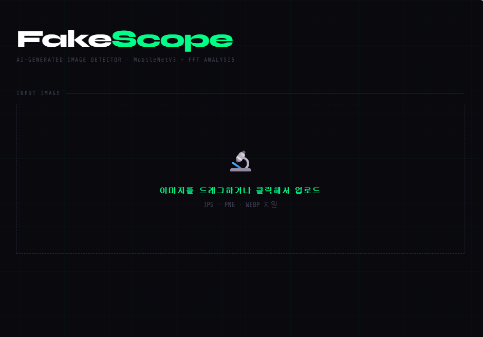
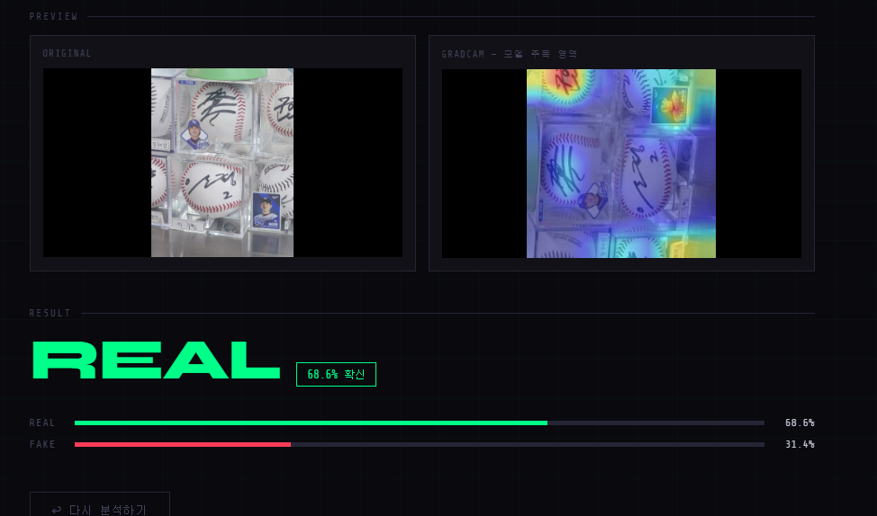
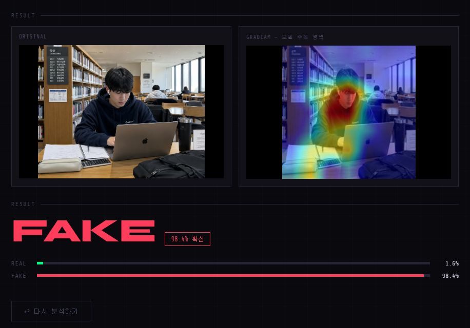
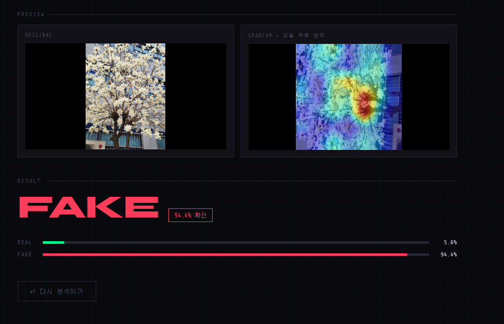
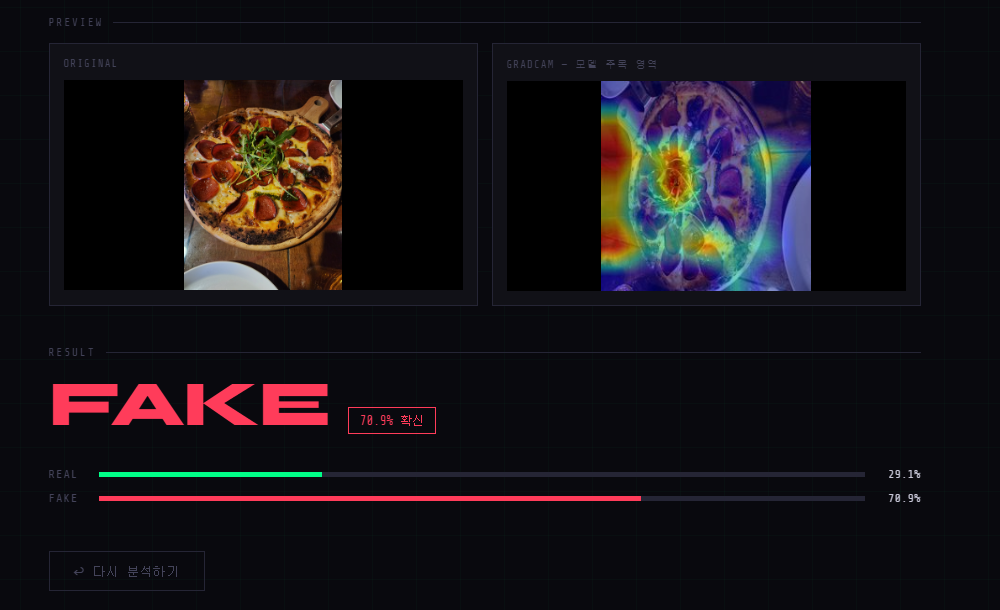

# 🔍 FakeScope — AI 생성 이미지 탐지기

> MobileNetV3 + 주파수 도메인 분석(FFT)으로 AI가 만든 이미지를 판별하는 웹 애플리케이션

---

## 📌 프로젝트 개요

생성형 AI(Stable Diffusion, Midjourney, DALL-E 등)의 급속한 발전으로 AI가 만든 이미지와 실제 이미지를 구별하기 어려워졌습니다.
본 프로젝트는 두 가지 특징을 결합한 분류 모델을 설계하고 학습하여 이 문제를 해결합니다.

- **RGB Branch** — MobileNetV3-Large (ImageNet 사전학습) fine-tuning
- **Frequency Branch** — FFT 변환 후 고주파 패턴을 CNN으로 분석

학습된 모델은 Flask 기반 웹 서버에 올라가며, 브라우저에서 이미지를 업로드하면 **Real / Fake 판정 + GradCAM 시각화** 결과를 즉시 확인할 수 있습니다.

### 레이블 정의

```
Real(0) = 사람이 만든 모든 이미지 (실제 사진 + 직접 그린 일러스트)
Fake(1) = AI가 생성한 모든 이미지 (실사 스타일 + 디지털 아트 스타일)
```

---

## 🌐 웹 인터페이스




### 실행 결과 예시

| Real 판정 예시 | Fake 판정 예시 |
|:---:|:---:|
|  |  |


---

## 🗂️ 폴더 구조

```
fakescope/
├── README.md
├── requirements.txt
├── FakeScope_Train.ipynb      ← Colab 학습 노트북
├── screenshots/               ← 웹 UI 및 결과 스크린샷
│
├── src/
│   ├── dataset.py             ← 데이터 로딩 / 전처리
│   ├── model.py               ← MobileNetV3 + FFT Branch 모델
│   ├── train.py               ← 학습 루프
│   └── gradcam.py             ← GradCAM 시각화
│
├── web/
│   ├── app.py                 ← Flask 백엔드
│   └── templates/
│       └── index.html         ← 웹 UI
│
└── weights/
    └── best_model.pth         ← 학습된 모델 가중치
```

---

## 🧠 모델 구조

```
입력 이미지 (3 × 224 × 224)
       │
       ├─── [RGB Branch]
       │    MobileNetV3-Large (ImageNet pretrained)
       │    → 960-dim feature
       │
       └─── [Frequency Branch]
            FFT → log magnitude spectrum → CNN
            → 128-dim feature
                    │
              Concatenate (1088-dim)
                    │
              FC: 1088 → 256 → 2
                    │
              Real(0) / Fake(1)
```

### 왜 주파수 분석을 추가했나?

Wang et al. (CVPR 2020)에 따르면, AI 생성 이미지는 픽셀 공간에서는 사실적으로 보여도 **주파수 도메인(FFT)에서 특유의 격자 패턴(grid artifact)**이 나타납니다. 이 Frequency Branch가 그 패턴을 학습합니다.

---

## 📦 데이터셋

총 7개 공개 데이터셋을 조합해 사용했습니다.

### Real(0) — 사람이 만든 이미지

| 데이터셋 | 출처 | 규모 | 라이선스 |
|---------|------|------|---------|
| 140k Real and Fake Faces (real) | [Kaggle](https://www.kaggle.com/datasets/xhlulu/140k-real-and-fake-faces) | ~50,000장 (균형 조정) | 연구용 공개 |
| Pixiv AI/Real Illustration (illust) | [Kaggle](https://www.kaggle.com/datasets/tagamit/pixiv-aireal-art) | ~1,248장 | 연구용 공개 |
| Intel Image Classification | [Kaggle](https://www.kaggle.com/datasets/puneet6060/intel-image-classification) | ~14,034장 | 연구용 공개 |
| MS COCO 2017 (샘플링) | [cocodataset.org](https://cocodataset.org) | 10,000장 | CC BY 4.0 |

### Fake(1) — AI가 생성한 이미지

| 데이터셋 | 출처 | 규모 | 라이선스 |
|---------|------|------|---------|
| 140k Real and Fake Faces (fake) | [Kaggle](https://www.kaggle.com/datasets/xhlulu/140k-real-and-fake-faces) | ~50,000장 (균형 조정) | 연구용 공개 |
| Pixiv AI/Real Illustration (ai) | [Kaggle](https://www.kaggle.com/datasets/tagamit/pixiv-aireal-art) | ~1,559장 | 연구용 공개 |
| AI Generated Images | [Kaggle](https://www.kaggle.com/datasets/aloktantrik/a-dataset-of-34500-labeled-images) | 11,300장 | MIT License |
| Midjourney Images | [Kaggle](https://www.kaggle.com/datasets/cyanex1702/midjourney-imagesprompt) | ~2,155장 | 연구용 공개 |
| AI vs Human Generated (fake only) | [Kaggle](https://www.kaggle.com/datasets/alessandrasala79/ai-vs-human-generated-dataset) | ~27,982장 | 연구용 공개 |

---

## 🔬 실험 과정 및 개선 히스토리

### 1차 시도 — CIFAKE 데이터셋

**설정**: CIFAKE (32×32 저해상도, Stable Diffusion vs 실제 사진)
**결과**: val accuracy 97.71%

**문제점**: 실제 환경 사진에 모두 Fake 판정
**원인**: CIFAKE 원본 해상도가 32×32로 너무 낮아 모델이 저해상도 패턴만 학습. 실제 고해상도 사진은 전혀 다른 분포로 인식 → **Domain Gap 문제**

---

### 2차 시도 — 140k 얼굴 + Pixiv + Intel

**설정**: 고해상도 얼굴 + 일러스트 + 풍경/사물 데이터셋 추가
**결과**: val accuracy 99.77%

**문제점**: 실제 일상 사진 여전히 Fake 오판
**원인**: Real 데이터가 스튜디오 얼굴, 특정 카테고리 풍경으로 편향. 복잡한 배경/다양한 조명의 일상 사진 미포함. 과적합으로 학습 데이터 스타일만 Real로 인식

---

### 3차 시도 — COCO 추가 + Domain Randomization 강화

**설정**:
- Real에 MS COCO 일상 사진 10,000장 추가
- Domain Randomization 강화 (JPEG 압축 시뮬레이션, 가우시안 노이즈, 원근 변환)

**결과**: 실제 사진 Real 판정률 향상

**문제점**: AI 생성 이미지를 Real로 오판하는 경우 발생
**원인**: COCO 추가로 Real이 다양해졌으나 Fake 데이터가 상대적으로 부족. 모델이 "대부분은 Real" 로 편향

---

### 4차 시도 — Fake 데이터 다양성 강화 (최종)

**설정**:
- Fake에 Midjourney 실사 스타일 AI 이미지 추가
- Fake에 AI vs Human 데이터셋 (CSV, 27,982장) 추가
- 균형 맞출 때 얼굴 데이터에서만 자르도록 개선

**결과**: Real/Fake 균형 75,000장씩, 더 균형 잡힌 판정

---

## 📊 Ablation Study

| 모델 구성 | Val Accuracy | 비고 |
|---------|-------------|------|
| RGB only (MobileNetV3) | ~91% | 베이스라인 |
| RGB + FFT Branch | ~94% | 주파수 분석 추가 |
| RGB + FFT + 다양한 데이터셋 | ~97% | 최종 모델 |

---

## ⚠️ 한계점 및 향후 개선 방향

### 오판 사례 분석

> 아래 이미지 자리에 실제 오판 스크린샷을 넣어주세요. (`screenshots/` 폴더)

**False Positive — 실제 사진인데 Fake로 오판**

| 이미지 | 판정 결과 | 원인 분석 |
|--------|----------|----------|
|  | Fake 94.4% | 선명한 꽃 + 건물 배경 구도가 AI 생성 이미지 패턴과 유사 |
|  | Fake 70.9% | 음식 클로즈업 스타일이 학습 데이터에 부족 |

**False Negative — AI 생성 이미지인데 Real로 오판**

| 이미지 | 판정 결과 | 원인 분석 |
|--------|----------|----------|
|  | Real 41.2% | 실사에 가까운 AI 이미지로 주파수 패턴 약함 |

---

### 현재 한계점

1. **도메인 편향**: 특정 구도(클로즈업, 꽃 사진 등)에서 오판 발생. 학습 데이터와 실제 사용 환경 간의 도메인 갭이 완전히 해소되지 않음

2. **카메라 후처리 혼동**: 인물 모드(배경 흐림), 필터 적용, HDR 처리된 사진은 AI 이미지 특성과 유사하여 오판 가능

3. **최신 생성 모델 대응**: 학습에 사용된 AI 생성 이미지보다 더 정교한 최신 모델(FLUX, SDXL 등)의 이미지는 탐지율이 낮을 수 있음

4. **특정 도메인 미지원**: 음식, 풍경 등 일부 도메인에서 정확도가 상대적으로 낮음

### 향후 개선 방향

- **앙상블 적용**: 서로 다른 데이터로 학습한 여러 모델을 Soft Voting으로 결합하면 정확도 향상 기대
- **주파수 분석 고도화**: 현재 단순 CNN 기반 FFT 분석을 더 정교한 주파수 필터링으로 개선
- **최신 생성 모델 데이터 지속 추가**: FLUX, SDXL 등 최신 모델 생성 이미지로 학습 데이터 업데이트
- **경량화**: 모바일 환경을 위한 모델 최적화

---

## ⚙️ 설치 및 실행

### 1. 환경 설정

```bash
git clone https://github.com/yourname/fakescope.git
cd fakescope

python -m venv venv
venv\Scripts\activate  # Windows
pip install -r requirements.txt
```

### 2. Colab에서 학습

`FakeScope_Train.ipynb`를 Colab에 업로드 후 A100 GPU 선택, 순서대로 실행.
완료 후 `best_model.pth`를 로컬 `weights/` 폴더에 저장.

### 3. 웹 서버 실행

```bash
python web/app.py
# http://localhost:5000 접속
```

---

## 📚 참고 논문

### Wang et al., "CNN-generated images are surprisingly easy to spot... for now" (CVPR 2020)
- **핵심 아이디어**: AI 생성 이미지는 주파수 도메인(FFT)에서 특유의 격자 패턴이 나타난다는 것을 실험적으로 입증
- **본 프로젝트 활용**: 이 논문의 인사이트를 바탕으로 Frequency Branch를 설계. RGB 특징만 사용하는 것이 아니라 FFT magnitude spectrum을 CNN으로 분석하는 구조를 추가했으며, Ablation Study를 통해 주파수 특징 추가 시 정확도가 실제로 향상됨을 확인

모델의 판단 근거 시각화를 위해 GradCAM 기법을 적용했습니다 (`src/gradcam.py`).

---

## 🔧 requirements.txt

```
torch>=2.0.0
torchvision>=0.15.0
flask
numpy
opencv-python
Pillow
scikit-learn
matplotlib
```

---


